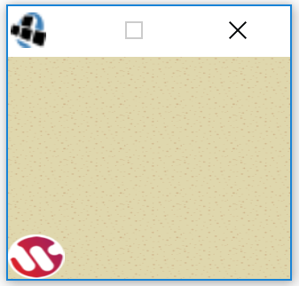
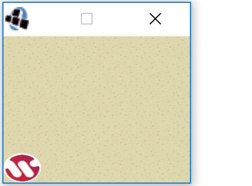
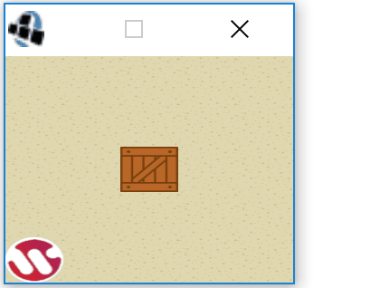
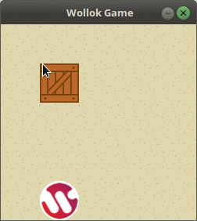

# Wollok Game

## Indice rápido ##

* <a href="#el-juego" class="wollokLink">El juego</a>
* <a href="#el-tablero" class="wollokLink">El tablero</a>
* <a href="#las-posiciones" class="wollokLink">Las posiciones</a>
	* <a href="#dibujando-objetos" class="wollokLink">Dibujando objetos</a>
	* <a href="#moviendo-objetos" class="wollokLink">Moviendo objetos</a>
* <a href="#el-personaje" class="wollokLink">El personaje</a>
* <a href="#visuales" class="wollokLink">Visuales</a>
* <a href="#un-juego-interactivo" class="wollokLink">Un juego interactivo</a>
	* <a href="#colisiones" class="wollokLink">Colisiones</a>
* <a href="#programas" class="wollokLink">Programas</a>
	* <a href="#cambiando-el-fondo" class="wollokLink">Cambiando el fondo</a>
	* <a href="#reportando-errores" class="wollokLink">Reportando errores</a>
	* <a href="#eventos-automaticos" class="wollokLink">Eventos automáticos</a>
	* <a href="#eventos-del-teclado" class="wollokLink">Eventos del teclado</a>
	* <a href="#mostrar-o-no-los-atributos-de-los-objetos-visuales" class="wollokLink">Mostrar o no atributos de los objetos visuales</a>
* <a href="#problemas-comunes" class="wollokLink">Problemas comunes</a>
* <a href="#para-seguirla" class="wollokLink">Para seguirla</a>

___

## ¿Qué es?

Wollok-Game es una biblioteca de Wollok que sirve para crear juegos. La idea que propone es tener una especie de "tablero" en donde se puedan meter los objetos de algún programa de Wollok y éste se mostrará automáticamente en la pantalla.
A continuación se describe cómo utilizarlo y las funcionalidades que proporciona..

## El juego

El objeto más importante para interactuar con Wollok Game es el objeto `game` que para poder utilizarlo hay que importar la biblioteca _game_ de Wollok.
Se debe incluir al inicio de cada archivo (.wlk o .wpgm):

```wollok
import wollok.game.*
```

Para comenzar un juego, y poder visualizar el tablero, basta con indicar:

```wollok
game.start()
```

Se levantar una ventana independiente del sistema operativo mostrando el tablero.


## ¿Cómo se usa?


### Por consola

La forma más básica es importar Wollok Game desde la consola (sin archivo asociado) haciendo

```wollok
>>> import wollok.game.*
```

Y luego enviar los mensajes uno a uno, como habitualmente se usa la consola. 

```wollok
>>> game.start()
```

### Por consola, con archivo de código .wlk

Una forma frecuente es usar un archivo .wlk y definir allí el código inicial como cualquier otro código wollok válido, hacerlo ejecutar y enviar los mensajes por consola para que se realicen las acciones deseadas. 

Archivo ejemplo.wlk

```wollok
import wollok.game.*

object prueba{
	method iniciar(){
		game.start()
	}
}
```

Al ejercutar por consola este archivo, hacer

```wollok
>>> prueba.iniciar() 
```

### Con un programa

Otra forma de trabajar es creando un archivo .wpgm, o Wollok program, donde se define el código del juego, que se ejecuta directamente al ejecutar el archivo, sin abrir la consola.

Archivo ejemplo.wpgm

```wollok
import wollok.game.*

program ejemplo{
	game.start()
}
```


## El tablero
Todo el mundo de Wollok Game pasa por el tablero. Aquí es donde se van a agregar los objetos que queremos mostrar en el juego y tiene las siguientes características:

- Es **único**, de modo que solo podemos tener un tablero por juego
- Todo el tablero **está dividido en celdas** de tamaño fijo (50 x 50 px), y todas las posiciones están en unidades de celdas.
- Tiene un **título**, manejado por la propiedad `game.title()`
- Tiene un **ancho**, expresado en _cantidad de celdas_, manejado por la propiedad `game.width()`
- Tiene un **alto**, expresado en _cantidad de celdas_, manejado por la propiedad `game.height()`
- Tiene una **imagen de celda**, que se settea por medio de `game.ground(imagen)`, en donde `imagen` es un string con el nombre del archivo de la imagen.
 
### Ejemplo

```wollok
import wollok.game.*

program ejemplo{
	game.width(10)
	game.height(7)
	game.title("Juego")
	game.start()
}
```

<div class="container text-center">
	
</div>


## Las posiciones

Ahora que sabemos cómo ver el tablero del juego, seguramente queramos meter objetos dentro para interactuar. Para ello necesitamos indicar en qué **posición** del tablero queremos agregar el objeto, a través de un objeto que sepa informar las coordenadas _(x,y)_.
Wollok provee objetos que representan a las posiciones, que también se encuentran en la bibliotea _game_. 

La forma más simple de obtener una posición es pedírsela al **game** 

Por ejemplo, teniendo corriendo cualquier archivo `.wlk` que incluya el import de `wollok.game.*` se puede probar en al consola:

```wollok
>>> game.at(2,3)
(2,3) // x = 2, y = 3 
>>> game.origin()
(0,0)
>>> game.center()
(2,2) //-> Se calcula a partir del height y width
```

Las posiciones entienden mensajes para cada coordenada

```wollok
>>> game.at(2,3).x()
2
>>> game.at(2,3).y()
3
```

## Dibujando objetos
Una forma es que el objeto tenga un método con nombre `position()` que retorne la posición en la que se quiere mostrar al objeto. Dicho método puede ser tan complejo o simple como se desee: puede tener una lógica específica que calcule la posición a partir de diversos factores o ser simplemente un método de acceso a una variable, en cuyo caso basta con definir `position` como propiedad.

```wollok
// Con propiedad
object wollok {
	var property position = game.origin()
}

// Con método 
object wollok {
	var centrado = false
	method position() = if (centrado) game.center() else game.origin()
}

``` 

Para que el objeto se muestre en el tablero de juego, se debe hacer

```wollok
game.addVisual(wollok)
```

¡Ya podemos visualizar nuestros objetos en pantalla!




### Otra opción
Tambíen se puede ubicar un objeto en el tablero sin necesidad de agregarle un método `position()` sino pasándole la posición inicial de la siguiente manera.

```wollok
game.addVisualIn(wollok,game.center())
```

### Otra opción más
También, las posiciones saben agregar un objeto al tablero. En este caso, tampoco hace falta que el objeto entienda el mensaje `position()`.

```wollok
var posicion = game.origin()
posicion.drawElement(wollok)
```

### Moviendo objetos
Una forma para que el objeto se mueva en el tablero es definiendo adecuacadamente el metodo `position()` y manipulando las referencias que se utilizan en él. 
Las posiciones son **objetos inmutables**, por lo que no se les puede cambiar sus coordenadas. Para ubicar objetos en posiciones diferentes se deben obtener nuevos objetos posición. 
En un caso simple, con una propiedad o un método que simplemente retorna la variable `position`, si modificamos la referencia a una posición diferente, el objeto se mueve a dicha ubicación.

```wollok
// Con propiedad
object wollok {
	var property position = game.origin()

	method centrar() {
		position = game.center()
	}
}

// Con método 
object wollok {
	var centrado = false
	method position() = if (centrado) game.center() else game.origin()

	method centrar() {
		centrado = true
	}
}

``` 

Las posiciones entienden los mensajes `right(c) left(c) up(c) down(c)` que devuelven nuevas posiciones con un desplazamiento de `c` casilleros en la dirección correspondiente. 

```wollok
object wollok {
	var property position = game.origin()

	method subir() {
		position = position.up(1) 
	}

	method enDiagonal(cant) { // se mueve cant posiciones en diagonal principal
		position = position.up(cant).right(cant) 
	}

}
```

## El personaje

Wollok Game te permite tener un _personaje especial_ y le da la capacidad de **moverlo con las flechas del teclado**. Basta con decirle al juego cuál objeto es el personaje a la hora de dibujarlo y su ubicación inicial.
En este caso, no se le define el método `position()` sino que el juego lo maneja por su cuenta. 

```wollok 
game.addVisualCharacterIn(wollok, game.origin())
//o game.origin().drawCharacter(wollok)
```



### Otra opción
Otra forma es ubicar el personaje especial mediante el método `addVisualCharacter(object)` sin indicar la posición inicial, sino tomándola del mismo obejeto.

```wollok 
game.addVisualCharacter(wollok)
```
En este caso, el objeto debe tener el método `position()` que se utiliza sólo para determinar la posición inicial. Dado que las sucesivas posiciones surgen a partir del uso del teclado, se ignora luego su valor de retorno. 


## Visuales

¡Perfecto! Ya podemos mostrar nuestros objetos en pantalla, pero se muestran como un _wollok object_.
Para elegir la imagen de un determinado objeto es necesario:

1. Tener una **carpeta fuente** en el proyecto Wollok **con todas las imágenes del juego**. Se puede crear haciendo _click derecho sobre el proyecto > Nueva > Otras... > Java > y buscan "Carpeta fuente"_. Luego pueden agregan las imagénes arrastrando / copiando como cualquier carpeta. El nombre de la carpeta suele ser _img_ o _assets_ por convención, pero es válido cualquier otro nombre. 
2. Agregar a tus objetos un método `image()` que **retorne el nombre del archivo de la imagen** como string, incluyendo la extensión.

### Ejemplo

<div class="container text-center">
	
</div>
<br>

### En example.wlk

```wollok
import wollok.game.*
object caja {
	method image() = "caja.png"
} 
```

### Y al ejecutar

```wollok
>>> game.start()
>>> game.addVisualIn(caja,game.center())
```


>  AVISO IMPORTANTE : Wollok Game no hace ninguna modificación a las imágenes para mostrarlas. De modo que deberán tener el **tamaño** y **orientación** apropiado para tu juego.

## ¡También hablan!

Así es, **los objetos del juego pueden hablar**. Para eso hay que indicar el `objeto` del juego y el `texto` que dirá por medio del mensaje `game.say(objeto, texto)`:

```wollok
game.say(wollok, wollok.howAreYou())
```


**Tip:** también saben gritar, fijate qué pasa si reemplazás `say` por `scream`.


## Un juego interactivo

Ya podemos mostrar nuestros objetos en el tablero, dónde y con la imagen que queramos. Ahora falta poder interactuar con el juego para que sea divertido.


## Colisiones
Una forma de hacer que tus objetos interactúen entre sí es por medio de colisiones. Estos son **bloques de código** que se agregan a un objeto del tablero y se ejecutará cuando otro objeto _colisione_ con éste (ocupe la misma posición). `game.whenCollideDo(objeto, accionConColisionado)`.

### Ejemplo


### En example.wpgm

```wollok
import wollok.game.*

object wollok {
	method howAreYou() = "I am Wolloktastik!"
}

object caja {
	var property position = game.center()
	method image() = "caja.png"
	method subir(){
		position = position.up(1)
	}
}

program ejemplo {
	game.addVisualCharacterIn(wollok,game.origin())	//Para que se pueda mover con las flechas
	game.addVisual(caja)
//	Apenas el personaje wollok colisione con la caja, el personaje habla y la caja se desplaza
	game.whenCollideDo(wollok, { elemento => 
		elemento.subir()
		game.say(wollok,wollok.howAreYou())
	})
	game.start()
}
```

**Tip:** si necesitás esa imagen la podés descargar en el directorio assets del ejemplo [sokoban](https://github.com/wollok/sokobanGame)


### Cambiando el fondo

Es posible modificar el fondo de nuestro tablero, para lo cual podés buscar cualquier imagen que te guste, como [ésta](www.todopaisajes.com%2Ffondos-de-pantalla-de-playas&psig=AOvVaw10Rdr1CY3aFnRTDZP9Pd-r&ust=1534606917743804). Lo descargamos en una carpeta fuente de nuestro proyecto.

En el programa agregamos el mensaje correspondiente al objeto game:

```wollok
import wollok.game.*
program ejemplo {
	game.width(10)
	game.height(10)
	game.boardGround("playa.jpg") // o el nombre con el que lo hayas bajado
	game.start()
}
```

Esto produce que en el tablero se visualice la imagen de fondo: 


De aquí en más volveremos con el fondo convencional para que distraiga menos la atención.


### Reportando errores

Cuando las cosas no salen como queremos y ocurre un error, el personaje especial es el que nos lo cuenta. Supongamos que modificamos el bloque que trabaja la colisión entre nuestro personaje wollok y la caja:

```wollok
program ejemplo {
	game.addVisualCharacterIn(wollok,game.origin())	
	game.addVisual(caja)
	game.whenCollideDo(wollok, { elemento => 
		const a = 1 / 0 //Se produce un error
	})
	game.start()
}
```

lo que pasa es que ocurre un error, y wollok es el que nos informa:


Por defecto, si hay un personaje es éste el responsable de avisar los errores que ocurren en el juego, y en caso de no haber personaje será cualquier objeto visual que esté en el tablero.

Igualmente nosotros podemos decirle que otro sea el objeto que reporte los errores de Wollok Game, como la caja:

```wollok
program ejemplo {
	//...
	game.errorReporter(caja)
	//...
}
```

Entonces cuando hay un error en un bloque de código que maneja Wollok Game, será la caja la que nos esté reportando un error:


### Eventos automaticos

Una funcionalidad interesante que podemos implementar es que **la caja se mueva cada n segundos** (por ejemplo, cada 2 segundos), enviando el mensaje `onTick()` al objeto `game`, el lapso de repetición expresado en milisegundos, un identificador (string descriptivo) y el bloque de código que debe ejecutar:

```wollok
program ejemplo {
	game.addVisualCharacterIn(wollok,game.origin())
	game.addVisual(caja)  // IMPORTANTE: ver el cartel de abajo
	// cada dos segundos muevo la caja
	game.onTick(2000, "movimiento", { caja.movete() })
	//
	game.start()
}
```

El método `movete()` en caja actualiza la posición en base a un valor al azar, tomando en cuenta el ancho y alto del tablero:

```wollok
object caja {
	var property position = game.center()
	method image() = "caja.png"
	method movete() {
		const x = 0.randomUpTo(game.width()).truncate(0)
		const y = 0.randomUpTo(game.height()).truncate(0)
		//otra forma de generar números aleatorios
		//const x = (0.. game.width()-1).anyOne() 
		//const y = (0.. game.height()-1).anyOne() 
		position = game.at(x,y) 
	}
}
```

Cuando ejecutamos el programa, vemos cómo la caja cada 2 segundos cambia de posición (y wollok debe andar con más cuidado):




### Eventos del teclado

Wollok Game permite capturar todos los eventos del teclado, para lo cual te recomendamos que leas la documentación del objeto autodefinido `keyboard`. En particular, podés definir qué tiene que pasar cuando un usuario presione una tecla. 
Así, un _ENTER_ podría hacer que el personaje salude, y la tecla _p_ que el movimiento de la caja se detenga.

```wollok
import wollok.game.*

program ejemplo {
	game.addVisualCharacterIn(wollok,game.origin())
	game.addVisual(caja)
	
	game.onTick(2000, "movimiento",{ caja.movete() })

	// capturamos el evento ENTER del teclado
	keyboard.enter().onPressDo {game.say(wollok,wollok.howAreYou())}	
	// capturamos el evento de presionar la tecla p del teclado
	keyboard.p().onPressDo {game.removeTick("movimiento")}	// Mensaje que detiene la acción repetitiva indicada
	game.start()
}
```

### Mostrar o no los atributos de los objetos visuales

Incorporemos los siguientes atributos al objeto visual wollok:

```wollok
object wollok {
	var property position = game.origin()
	var version = "1.7.0"
	var lastUpdated = new Date()
}
```

Esto hace que cuando paremos el mouse sobre dicho objeto, veamos su estado interno:


Si no queremos que ocurra esto (porque nos distrae tanta información en el tablero), podemos enviar el mensaje `hideAttributes()` a `game` indicando cuál es el objeto visual al que no queremos que se le vean los atributos:

```wollok
program ejemplo {
	game.addVisualCharacterIn(wollok,game.center())
	game.hideAttributes(wollok)
	//...
}
```

## Problemas comunes


Primero que nada, tené en cuenta que Wollok Game necesita Open GL 2.0 ó superior, si no lo tenés instalado, seguí [estas instrucciones](https://www.khronos.org/opengl/wiki/Getting_Started)

#### Error en Ubuntu

En algunas instalaciones de Ubuntu puede que te aparezca un mensaje de error como el siguiente al correr un programa de Wollok Game:

```
LwjglApplication: Couldn't initialize audio, disabling audio
java.awt.AWTError: Assistive Technology not found: org.GNOME.Accessibility.AtkWrapper
	at java.awt.Toolkit.loadAssistiveTechnologies(Toolkit.java:807)
	at java.awt.Toolkit.getDefaultToolkit(Toolkit.java:886)
	at org.lwjgl.LinuxSysImplementation.<clinit>(LinuxSysImplementation.java:50)
	at org.lwjgl.Sys.createImplementation(Sys.java:131)
	at org.lwjgl.Sys.<clinit>(Sys.java:116)
	at org.lwjgl.openal.AL.<clinit>(AL.java:59)
	at com.badlogic.gdx.backends.lwjgl.audio.OpenALAudio.<init>(OpenALAudio.java:72)
	at com.badlogic.gdx.backends.lwjgl.LwjglApplication.<init>(LwjglApplication.java:83)
	at com.badlogic.gdx.backends.lwjgl.LwjglApplication.<init>(LwjglApplication.java:64)
	at org.uqbar.project.wollok.game.gameboard.WollokGDXApplication.<init>(WollokGDXApplication.java:12)
	at org.uqbar.project.wollok.game.helpers.Application.start(Application.java:28)
	at org.uqbar.project.wollok.game.gameboard.Gameboard.start(Gameboard.java:86)
```

O simplemente el error `Assistive Technology not found: org.GNOME.Accessibility.AtkWrapper`. En ese caso, seguí los pasos que plantea [este sitio web](https://askubuntu.com/questions/695560/assistive-technology-not-found-awterror). Editá el archivo accessibility.properties

```bash
$ sudo edit /etc/java-8-openjdk/accessibility.properties\ # o cualquier otro editor que quieras
```

y comentá esta configuración

```bash
#assistive_technologies=org.GNOME.Accessibility.AtkWrapper
```

Con eso volvé a levantar el entorno Wollok y debería funcionar correctamente.

### Problema para ejecutar Wollok Game en MacOS HighSierra

Wollok Game utiliza SWT, un componente de Eclipse al que le [reportaron inconvenientes con la versión MacOS HighSierra](https://bugs.eclipse.org/bugs/show_bug.cgi?id=525465). En la próxima versión este problema estará resuelto, pero hasta tanto eso no ocurra te aconsejamos para salir del paso instalar una Virtual Machine de otro sistema operativo.

## Para seguirla

El código de los ejemplos mencionados está en  [este repositorio](https://github.com/wollok/ejemploGameSite) 

Te dejamos [esta documentación avanzada](https://github.com/leodelgadodev/Documentacion-wollokGame) que hizo Leo Delgado al usar Wollok Game en su curso.

También podés investigar [todos estos ejemplos](https://github.com/wollok?utf8=%E2%9C%93&q=game&type=&language=) en el repositorio de Wollok. ¡Que lo disfrutes!
