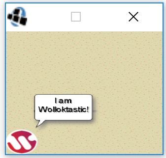
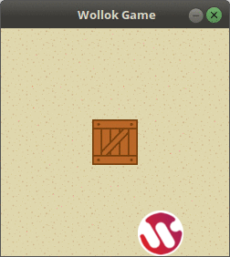
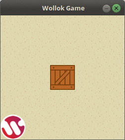

# Wollok Game

## Index

1. <a href="#the-game" class="wollokLink">The game</a>
1. <a href="#the-board" class="wollokLink">The board</a>
1. <a href="#positions" class="wollokLink">Positions</a>
	1. <a href="#drawing-objects" class="wollokLink">Drawing objects</a>
	1. <a href="#moving-objects" class="wollokLink">Moving objects</a>
1. <a href="#the-character" class="wollokLink">The character</a>
1. <a href="#visuals" class="wollokLink">Visuals</a>
1. <a href="#an-interactive-game" class="wollokLink">An interactive game</a>
	1. <a href="#collisions" class="wollokLink">Collisions</a>
1. <a href="#programs" class="wollokLink">Programs</a>
	1. <a href="#changing-board-background" class="wollokLink">Changing board background</a>
	1. <a href="#reporting-errors" class="wollokLink">Reporting errors</a>
	1. <a href="#automatic-events" class="wollokLink">Automatic events</a>
	1. <a href="#keyboard-events" class="wollokLink">Keyboard events</a>
	1. <a href="#show-or-hide-visual-objects-attributes" class="wollokLink">Show or hide visual objects attributes</a>
1. <a href="#more-info" class="wollokLink">More info</a>

____


## Objectives and Use

Wollok-Game allows you to create games, building a board where you put different visual characters (objects). 

## The game

Main object is `game` object, located in Wollok _lib_ file. To start a game, just write in console:

```js
>>> game.start()
```

Now you should see a board in another window of your operating system.
<br>


## The board

Here you will add your game objects. Board has the following properties:  

- is a **singleton**, you can have only a single board per game
- the whole board is **divided into cells of fixed size** (50 x 50 px), and all positions are in units of cells.
- has **title**, accessible via `game.title()` message
- has a **width**, expressed in _cell_quantity_, accessible via `game.width()` message
- has a **height**, expressed in _cell_quantity_, accessible via `game.height()` message
- has a **cell image**, configurable via `game.ground(image)` message, where `image` is the image file name.
 
#### Example

```js
>>> game.width(10)
>>> game.height(7)
>>> game.title("A whole new Game")
>>> game.start()
```

<div class="container text-center">
	
</div>
<br>


## Positions

To put objects in the board we need to specify its **location**. In Wollok we have `Position` class (in _lib_ library) which provides a pair _(x,y)_ implementation. You can instantiate a Position using different approaches:

```js
// Invoking two parameter constructor
>>> new Position(2, 3)
(2,3) //-> (x=2; y=3)
>>> new Position()
(0,0) //-> default constructor uses origin of coordinate system

// Asking game position
>>> game.at(2,3)
(2,3)
>>> game.origin()
(0,0)
>>> game.center()
(2,2) //-> Calculated based on height & width
```

#### Drawing objects

Positions allow us to add an object in the board.
```js
>>> var position = game.origin()
(0,0)
>>> position.drawElement(wollok)
```

##### Another option

You can also define a position for any visual object (with a reference _position_ or a message _position()_) and tell the game to add an element in board:

###### In example.wlk
```js
object wollok {
	var position = game.origin()
}
```

###### And voilá...
```js
>>> game.addVisual(wollok)
```

...visual object is shown in board!


#### Moving objects

Positions are **mutable** properties, so its components _(x, y)_ can change in time. Then, we can **move objects** in board without changing its position object (or even worse, having to remove and add it again).

```js
>>> position   // remember position reference is defined below
(0,0)
>>> position.moveRight(2)
>>> position.moveUp(3)
>>> position
(2,3)
```

## The character

Wollok Game allows you to define a _main character_, movable with arrow keys of the keyboard. You just set **the character** of the game before it starts.

```js
>>> game.addVisualCharacter(wollok)
//or game.origin().drawCharacter(wollok)
>>> game.start()
```


### Look who's talking!

**Game objects can talk, too**, if you send a message `game.say(visualObject, textToSay)`:
```js
>>> game.say(wollok, wollok.howAreYou())
```


**Tip:** visual objects can scream too, just try `scream()` message instead of `say()`


## Visuals

By now, we can show objects in the board as _wollok objects_. To change default image you have to

1. Have a **source folder** in your Wollok project **with all images of the game**. To create this folder, you have to _right click over the project > New > Other.. > and search "Source folder"_. Then add images by copying or dragging just like any other folder.
2. Afterwards you have to add a `image()` method that will **return the name of the image file name** as a string.

#### Example

<div class="container text-center">
	
</div>
<br>

###### In example.wlk

```js
object box {
	method image() = "box.png"
}
```

###### Let's execute it

```js
>>> game.start()
>>> game.center().drawElement(box)
```


>  IMPORTANT MESSAGE : Wollok Game doesn't resize the images you show, so you have to manually adjust **size** and **orientation** according to your game.

## An interactive game

Now we will see how objects interact with game, to be more challenging.

### Using REPL console
An easy way is to send messages through **REPL console**. You can change size, position, etc. and this changes will be reflected in board.

### Collisions
When two objects share the same position, Wollok Game throws a _collision_ event. A collision is implemented as a **closure (piece of code)** added to a certain object: `game.whenCollideDo(object, actionClosure)`.

#### Example


###### In example.wlk
```js
object wollok {
	const property position = game.origin()
	
	method goHome() {
		position.x(0)
		position.y(0)
	}
}

object box {
	var property position = game.center()
	method imagen() = "box.png"
} 
```

**Tip:** if you need the box image you can download it in assets folder of [sokoban project](https://github.com/wollok/sokobanGame) and rename "caja.png" to "box.png".


###### Executing
```js
>>> game.addVisualCharacter(wollok) // Movable with arrow keys
>>> game.center().drawElement(box)
>>> game.whenCollideDo(box, { character => character.goHome() })
	// When a character collides with box, it goes to initial position
>>> game.start()
```


### Programs

You can also generate a Wollok program (.wpgm extension), where a main _character_ moves over the board when events are fired from keyboard, and several things happens...

Lets code out REPL example into a program, importing wollok wko and box definitions:

```js
program firstWollokGameProgram {
	game.addVisualCharacter(wollok)
	game.center().drawElement(box)
	game.whenCollideDo(box, { character => character.goHome() })
	game.start()
}
```

#### Changing board background

You can change out board background, replacing default one with [any picture you like](https://www.google.com.ar/url?sa=i&source=images&cd=&cad=rja&uact=8&ved=2ahUKEwimy6fJtvTcAhVFxpAKHRdhBK4QjRx6BAgBEAU&url=https%3A%2F%2Fwww.todopaisajes.com%2Ffondos-de-pantalla-de-playas&psig=AOvVaw10Rdr1CY3aFnRTDZP9Pd-r&ust=1534606917743804). Download it to a new source folder, in this case called `assets`, and add in your program a message to `game` object:

```js
program firstWollokGameProgram {
	game.width(10)
	game.height(10)
	game.boardGround("beach.jpg") // replace here beach.jpg with the name you used
```

Now we see a new image in game board:


From now on we will go back to default and less distracting background.


#### Reporting errors

When things go wrong, our main character catches error messages and alert us. Lets suppose we change collider block between our main character wollok and the box:

```js
program firstWollokGameProgram {
	game.addVisualCharacter(wollok)
	game.center().drawElement(box)
	game.whenCollideDo(box, { 
		character => character.goHome()
		const a = 1 / 0
	})
	game.start()
}
```

When wollok and box collides, wollok reports a "division by zero" error:



In Wollok Game, if there is a main character, it is responsible to catch and report any error inside the game. Otherwise, any visual object in board will do that.

Anyway, we can configure _error reporter object_ to another object, such as the box:

```js
program firstWollokGameProgram {
	game.addVisualCharacter(wollok)
	game.center().drawElement(box)
	game.errorReporter(box)
	...
```

So lets see what happens now when wollok and the box collides and an error is thrown:


#### Automatic events

You can configure an automatic event, such as **box should move every 2 seconds**, if you send `onTick()` message which expects a block to be called every n milliseconds:

```js
program firstWollokGameProgram {
	game.addVisualCharacter(wollok)
	game.addVisual(box)  // see warning below
	//
	// moving box every 2 seconds
	game.onTick(2000, { box.moveOn() })
	//
	game.whenCollideDo(box, { character => character.goHome() })
	game.start()
}
```

> VERY IMPORTANT: the box should be added into the game using `game.addVisual(box)` and not like before: `game.center().drawElement(box)`, it will listen all kind of events (and eventually will be able to move).

`moveOn()` method in box object will randomly update its position, based on board height and width:

```js
object box {
	var property position = game.center()
	method image() = "box.png"
	method moveOn() {
		const x = 0.randomUpTo(game.width() - 1).truncate(0)
		const y = 0.randomUpTo(game.height() - 1).truncate(0)
		self.position().x(x)
		self.position().y(y)
	}
}
```

When program is executed, we'll see a box movement every 2 seconds (and wollok object should be more careful):


#### Keyboard events

Every time the user hits a key, an event is fired, so it is a good starting point to read `keyboard` wko documentation. Lets see this example, where we activate/deactivate box automatic movement when the user presses ENTER key:

```java
import example.*
import wollok.game.*

program firstWollokGameProgram {
	var boxMoves = true
	game.addVisualCharacter(wollok)
	game.addVisual(box)
	game.onTick(2000, { if (boxMoves) box.moveOn() })
	//
	// ENTER key is caught
	keyboard.enter().onPressDo { boxMoves = !boxMoves }	
	//
	game.whenCollideDo(box, { character => character.goHome() })
	game.start()
}
```

Here is our live demo:




#### Show or hide visual objects attributes

Lets add some attributes to wollok wko:

```js
object wollok {
	var property position = game.origin()
	var version = "1.7.0"
	var lastUpdated = new Date()
	...
```

When we pass mouse over wollok, we can see its internal state:


If we don't want to show overwhelming information to user, we can send `hideAttributes()` message to `game`:

```js
program firstWollokGameProgram {
	var boxMoves = true
	game.addVisualCharacter(wollok)
	game.hideAttributes(wollok)
	...
```

### More info

You can download [all these Wollok Game examples](https://github.com/wollok?utf8=%E2%9C%93&q=game&type=&language=) from Wollok repository. Enjoy them!
